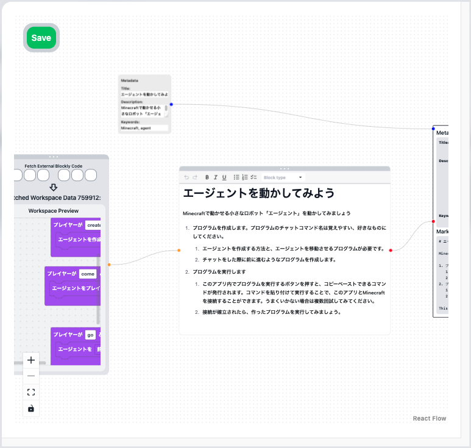

import {
  LinkCard,
  Card,
  CardGrid,
  Aside,
  Icon,
} from "@astrojs/starlight/components";

TutoriaLLM is a self-hosted programming learning platform using LLM, available on the web. This platform is designed for those who create educational content and those who learn from that content.

<Aside type="caution" title="Caution">
  TutoriaLLM is software for creating a site that provides tutorials on a
  server, not the name of a standalone application. You can use TutoriaLLM to
  host an application that provides tutorials.
</Aside>

## Features

This platform allows you to easily create programming tutorials and provide them to learners. Both content creators and learners can have a better learning experience through this app. Please take a look at the following slides first.

This presentation is in Japanese.

  <iframe
    src="https://docs.google.com/presentation/d/1PYHkX_mpfPebbhWHdUw9v0uklFfV1K9j07MLMhHmT4k/embed?start=false&loop=false&delayms=3000"
    style="position: absolute; top: 0; left: 0; width: 100%; height: 100%;"
    frameborder="0"
    allowfullscreen="true"
    mozallowfullscreen="true"
    webkitallowfullscreen="true"
  ></iframe>

### For Learners

Users utilizing the tutorials can learn the basics of programming through interactive sessions with LLM (AI) via an intuitive interface. All you need is a web browser, and since all sessions are managed on the server side, you can resume from any device at any time.

Additionally, the programs created in the tutorials are executed on the server side and can be integrated with other applications. Currently, [integration with Minecraft](/userguides/minecraft) is possible, allowing you to run programs.

> Images are from the development phase and may differ from the actual interface.

### For Content Creators

Editors creating tutorials can use powerful tools to create tutorials in a short time. The created tutorials can be offered to users on the TutoriaLLM platform. By using TutoriaLLM on your domain, you can build a custom tutorial app and provide original educational content.

> Images are from the development phase and may differ from the actual interface.

The editor can also track the progress of users in real-time and see what actions they are taking.

## Get Started

### Join the Community

Join the TutoriaLLM community to connect with other users. Join the Discord server to get the latest updates.

<LinkCard
  title="Discord Server"
  description="Join the TutoriaLLM community."
  href="https://discord.gg/VYWr3QDht2"
/>

### Try the Demo

If you are a beginner in programming, start by trying the demo. Through this demo, you can experience the app's features.

<LinkCard
  title="Try the Demo"
  description="Experience the TutoriaLLM demo."
  href="https://demo.tutoriaLLM.com"
/>

<Aside type="caution" title="Caution">
  TutoriaLLM is server software for creating a site that provides tutorials, not
  the name of an application.
</Aside>

### Host TutoriaLLM

If you want to create and publish tutorials, use TutoriaLLM to create a dedicated application. Learn how to do this with the guide below.

<LinkCard
  title="GitHub Repository"
  description="Check the source code of TutoriaLLM."
  href="https://github.com/tutoriaLLM/tutoriaLLM"
/>

<LinkCard
  title="Creation Guide"
  description="Learn how to create tutorials using TutoriaLLM."
  href="/en/editorguides/introduction"
/>
