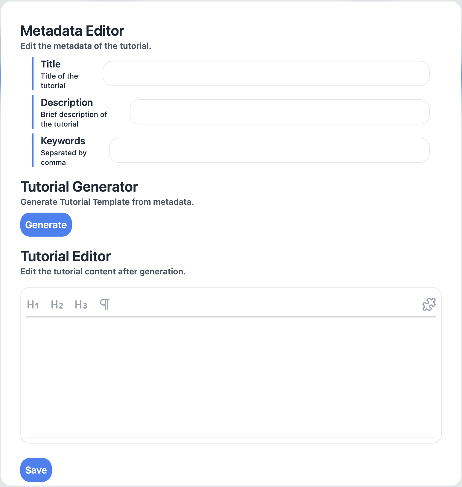

import {
  LinkCard,
  Card,
  CardGrid,
  Aside,
  Icon,
} from "@astrojs/starlight/components";

TutoriaLLM(チュートリア LM) は、Web 上で使用できる、LLM によって提供されるセルフホスト型プログラミング学習プラットフォームです。教育コンテンツを制作する人と、そのコンテンツから学ぶ人たちのために設計されています。

<Aside type="note" title="ノート">
  このプロジェクトは 2024 年度の未踏ジュニアに採択され、最終報告会（11
  月）までにすべての機能が使用できるようになる予定です。
</Aside>
<Aside type="caution" title="注意！">
  TutoriaLLMはあくまでもチュートリアルを提供するサイトを作るためにサーバー上で利用できるソフトウェアの名前であり、アプリケーションの名前ではありません。そのため、このドキュメントでは、アプリケーションを作成する人を「エディター」と呼び、チュートリアルを利用する人を「ユーザー」と呼びます。
</Aside>
## 特徴

このアプリでは、プログラミングについて学ぶチュートリアルを作成し、それを利用する人たちに提供することができます。チュートリアルを使う人と作る人の両方が、このアプリを使うことで、より良い体験を得ることができます。

### チュートリアルを使う人（ユーザー）

チュートリアルを利用するユーザーは、画面のような操作画面から、LLM（AI）により対話のセッションが提供され、プログラミングの基礎学習をすぐに始めることができます。必要なものは Web ブラウザだけです。
ユーザーのセッションはすべてサーバー側で管理し、どのようなデバイスでも実行でき、途中で中断しても、再開することができます。
チュートリアルで作成したプログラムは、そのままサーバー側で実行され、外部のアプリケーションと連携することも可能です。現時点では、[Minecraft と連携](/guides/minecraft)し、プログラムを実行することができます。

> 画像は開発中のもので、実際の画面とは異なる場合があります。

### チュートリアルを作る人（エディター）

チュートリアルを作る人は、強力なチュートリアル作成機能を利用して、ほんの数分でチュートリアルを作成することができます。チュートリアルの作成には、Markdown 記法を使用し、プログラムの実行結果を表示することも可能です。

> 画像は開発中のもので、実際の画面とは異なる場合があります。

また、チュートリアルの進行状況を確認することもできます。ユーザーのセッションをリアルタイムで追跡し、どのような操作を行っているかを確認することができます。

## 使ってみる

### チュートリアルで学んでみる

もしあなたがプログラミング初心者で、プログラミングを学びたいと考えているなら、まずはデモを試してみてください。デモは、このアプリの機能を体験することができます。

<LinkCard
  title="デモで試す"
  description="TutoriaLLM のデモを試してみましょう。"
  href="https://demo.tutoriaLLM.com"
/>
<Aside type="caution" title="注意！">
  TutoriaLLMはあくまでもチュートリアルを提供するサイトを作るためにサーバー上で利用できるソフトウェアの名前であり、アプリケーションの名前ではありません。
</Aside>

### チュートリアルを作ってみる

チュートリアルを作ってみんなに公開したい場合は、TutoriaLLM を使ってチュートリアルを提供するアプリを作ってみましょう。チュートリアルを作成するためのガイドをご覧ください。

<LinkCard
  title="アプリの GitHub リポジトリ"
  description="TutoriaLLM のソースコードを確認しましょう。"
  href="https://github.com/tutoriaLLM/tutoriaLLM"
/>

<LinkCard
  title="作成方法を学ぶ"
  description="TutoriaLLMを利用して、チュートリアルを作成する方法を学びましょう。"
  href="/ja/editorguides/introduction"
/>
