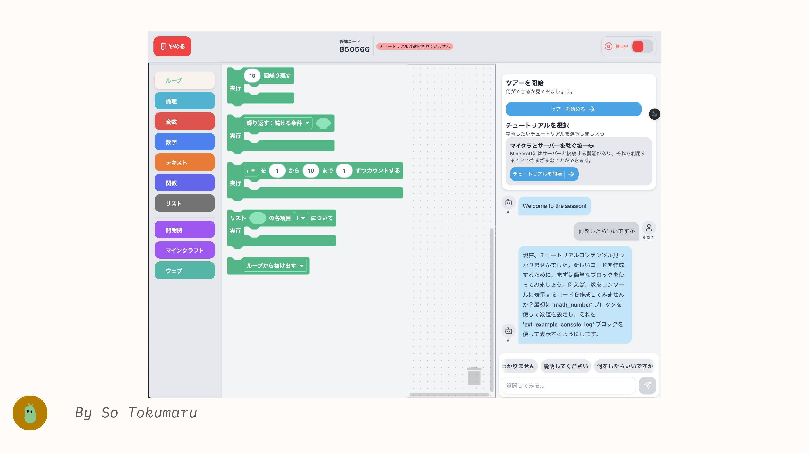
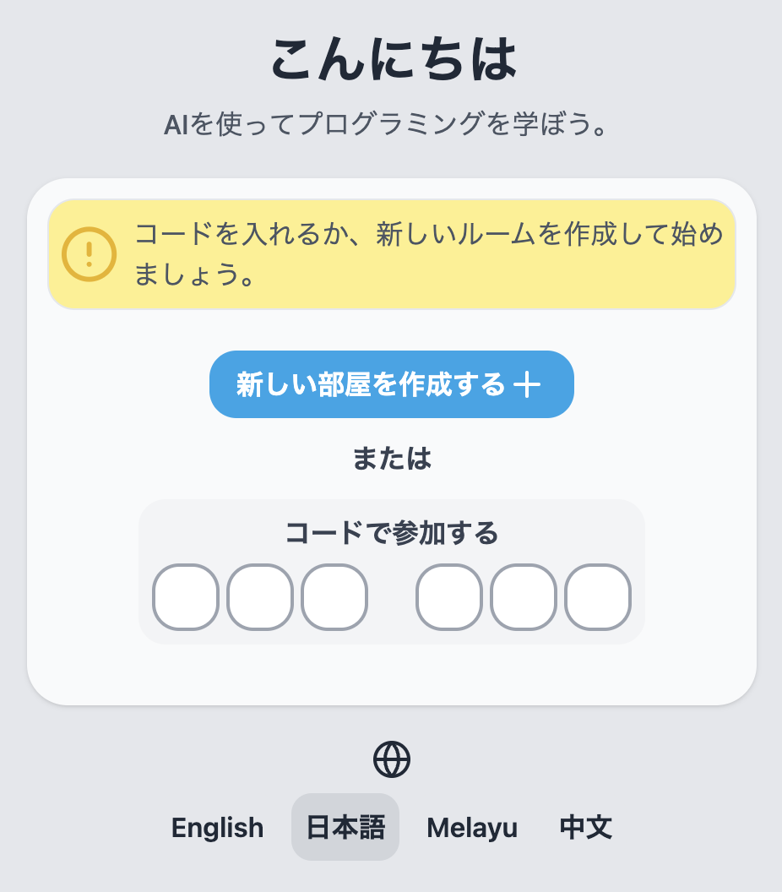

import {
  LinkCard,
  Card,
  CardGrid,
  Aside,
  Icon,
  Steps,
} from "@astrojs/starlight/components";

<Aside type="note" title="ノート">
  アプリについての詳しい説明は[TutoriaLLM について](/ja/introduction)
  をご覧ください。
</Aside>

## TutoriaLLM について

TutoriaLLM(チュートリア LM) は、Web 上で使用できる、LLM によって提供されるセルフホスト型プログラミング学習プラットフォームです。
教育コンテンツを制作する人と、そのコンテンツから学ぶ人たちのために設計されています。

## ユーザーテスト

TutoriaLLM は現在、ユーザーテストを実施しています。
ユーザーテストでは、開発中のアプリケーションに、さまざまなユーザーからの意見を取り入れる目的で、アプリを使用したユーザーに対して聞き取りやアンケートを行います。

<Aside type="note" title="ノート">
  アプリ自体はすでに公開されています。[TutoriaLLM](https://demo.tutoriallm.com)
  にアクセスして、アプリを試してみてください。
</Aside>

### 現在調査を行っている機能

<CardGrid>
  <Card title="コード実行" icon="forward-slash">
    コードを実行する機能の接続安定性、実行速度、エラーメッセージのわかりやすさ
  </Card>
  <Card title="コード作成" icon="puzzle">
    コードを作成する際のブロックエディタの使い勝手、コードの読みやすさ
  </Card>
  <Card title="LLMとの対話" icon="comment-alt">
    LLM との対話の自然さ、回答の質、回答のタイミングなど
  </Card>
  <Card title="全体的なユーザー体験" icon="rocket">
    アプリケーション全体の使い勝手、デザイン、機能の使いやすさ
  </Card>

</CardGrid>

### 参加方法

ユーザーテストは、TutoriaLLM の新機能やアプリケーションの使い勝手を確認するために行われます。ユーザーテストに参加することで、新機能の使い方やアプリケーションの使い勝手についてフィードバックを提供することができます。

#### アプリを使ってみる

ページにアクセスして、アプリを試してみてください。

<Aside type="caution" title="注意！">
  現時点では作成したセッションは定期的に削除されることがあります。セッションの保存は行われませんので、ご了承ください。
</Aside>

<Steps>
1. [TutoriaLLM](https://demo.tutoriallm.com) にアクセスします。必要に応じて、言語の選択を行います。

2. 過去のセッションを再開する場合はセッションコードを入力します。新しいセッションを開始する場合は、新しいセッションを開始します。

3. セッションを開始すると、すぐにプログラミングの学習を始めることができます。セッションはサーバー側で管理され、途中で中断しても再開することができます。

</Steps>

<LinkCard
  title="デモを開始"
  description="TutoriaLLM のデモを試してみましょう。"
  href="https://demo.tutoriallm.com"
/>
#### 回答を提供する

アプリを使ってみた後、以下の Google フォームから回答を提供していただけると幸いです。回答はアプリの改善を目的に使用されます。

<LinkCard
  title="ユーザー調査（2024年8月）"
  description="フォームから回答を提供してください。"
  href="https://forms.gle/eunWwxdwNzfyQZfu8"
/>
